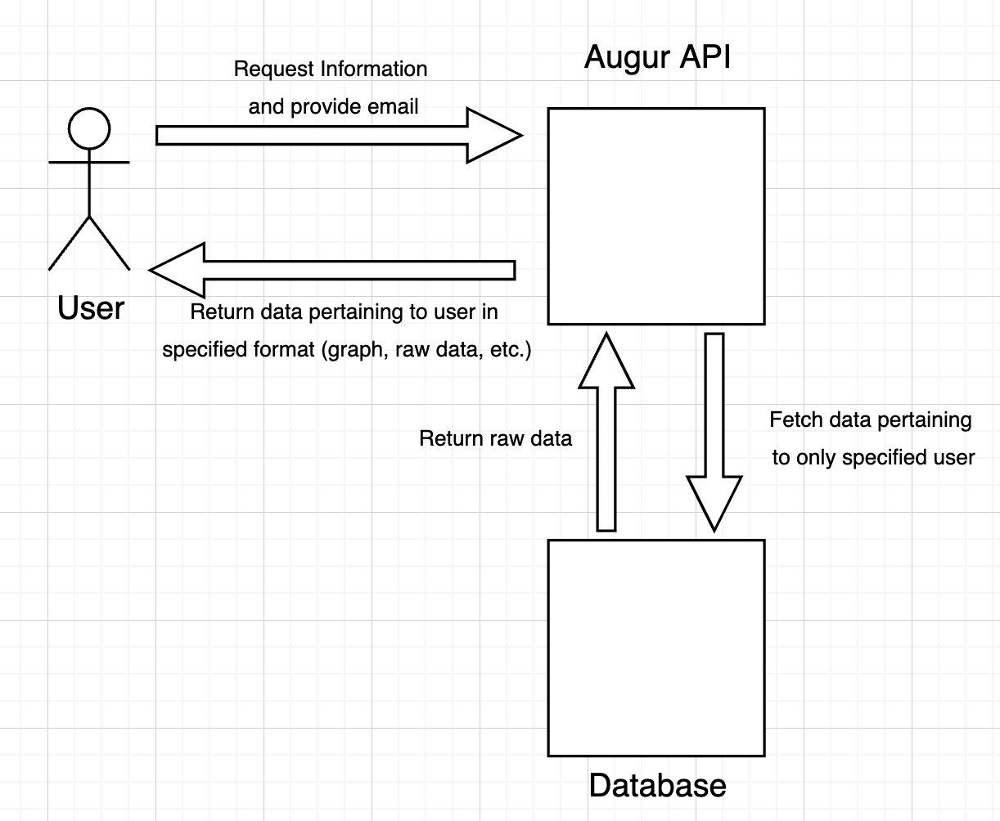

# **CS4320 Software Engineering**
Group 1: Ashton Hess, Tyler Wilkins, Solomon DellaPenna, Jayson Ashford

## **Fetching Data by Email: Endpoints**

## **Description:**
The use case for adding these endpoints to Augur is to give the user the ability to search certain metrics by email. By adding these endpoints to query the database by, this addition expands the user’s flexibility in selecting search terms to query information about a specific user. Expanding the database’s ability to handle searching information on specific users also provides more information that could be displayed on the frontend or extrapolated to provide the user more specific information. 

## **Triggers:**
When a user wants to pull specific information from the database pertaining to a specific email.
Could be used at program startup to populate information that is displayed to the user. This could be charts, graphs, lists, etc. 
Could be triggered by other programs to populate a database.

## **Actors:**
Users(students) wanting specific data for themselves or group mates to see their contributions
Developers(admins) wanting to use the system to populate database for their own project

## **Preconditions:**
The database must have information stored in the tables pertaining to the searches and the user’s emails.
Emails entered must not have some empty information in certain data positions.

## **Main Success Scenario (goals):**
Produce useful data for the user about certain emails and comments given by that specific email. The program doesn't return the wrong data for a query. Users all consent for the data to be used in the program.

## **Alternate Success Scenarios:**
Users are able to only get some of the public information available to them.
Only some users consent to their information being able to be used for this.

## **Failed End Condition:** 
Users share privacy concerns related to their accounts email. If users are uncomfortable with their account emails being used this way, this would cause a failed end condition. 

## **Extensions:**

### **Steps of Execution (Requirements):**
A chart of requirements is provided in this folder. 

### **A Use Case Diagram (following the UML Standard for expressing use cases):**

## **Dependent Use Cases:**
One use case that could depend on these data endpoints is a UI element or anything on the front end that shows statistics pertaining to a user’s email. 
Another use case that could depend on these data endpoints is if Augur was used to monitor the work done by specific users on a project, the project manager could search users by email to see specific information about that user.
Another use case could also be for if another developer wants to use this to prepopulate graphs on startup.
