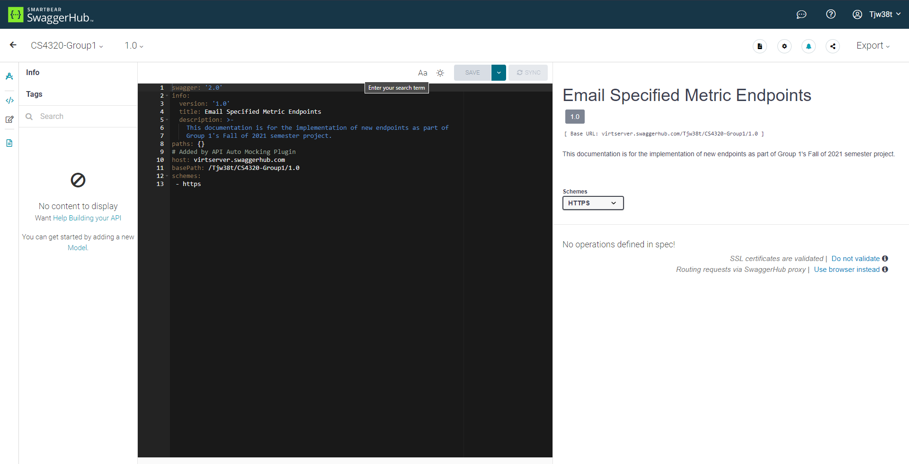

# CS4320 Group 1 Sprint3

Group Members:

Ashton Hess, Tyler Wilkins, Solomon DellaPenna, Jayson Ashford

## Project Description

Our team plans to create new API endpoints allowing users to pass a contributor's email as a parameter. The endpoints will then return data on the contributions of the contributor with the specific email address (if they exist). The data returned on a successful operation of these endpoints will be similar to the data already being fetched by existing endpoints, with the distinction of these new endpoints being contributor specific.   

## Progress report (indication about whether or not to update scope):

After several attempts and sessions with Dr. Goggins, the Augur database was successfully populated with the necessary data for developing our new API endpoints (thank you Ashton).

The existing Augur Metrics endpoints were reviewed in an effort to better understand how Augur;s API endpoints work. As well, this review provided us with a better understanding of existing SQL queries which may be able to serve as a basis for our own endpoint development.

Using the endpoint template provided by Dr. Goggins during Sprint2, code was added to two of our three feature branches. Specifics on these additions can be found in the lines-by-email and contributions-by-email branches. While this code is not developed enough to be considered complete (meaning final product ready), it certainly serves as a great initial draft from which Sprint4 can be completed.

Documentation was updated as well. These changes can be seen in each of our feature branches (contributions-by-email, lines-by-email, and comments-by-email), the new sprint-3 Branch, and the main branch. A Sprint3 directory was added to the sprint-3 and main branches as well.

Development of Open API documentation was started as shown in the image below. Though the image clearly shows a bare-bones start to this documentation, the documentation will be updated as features are developed. 

## Team reflection (obstacles encountered, reflections, goals):

For Sprint 3, one of our obstacles was getting a populated database established on our server with which we can test our endpoints. However, after several attempts, this obstacle was finally overcome. An additional obstacle that has been present since Sprint1, is the issue of communication. For whatever reason, communicating has been very difficult in our group, which makes distribution of work difficult as well. As we enter Sprint4, our group needs to focus on communication, and ensure that everyone knows what is happening and can find ways in which they can contribute to the project.   
